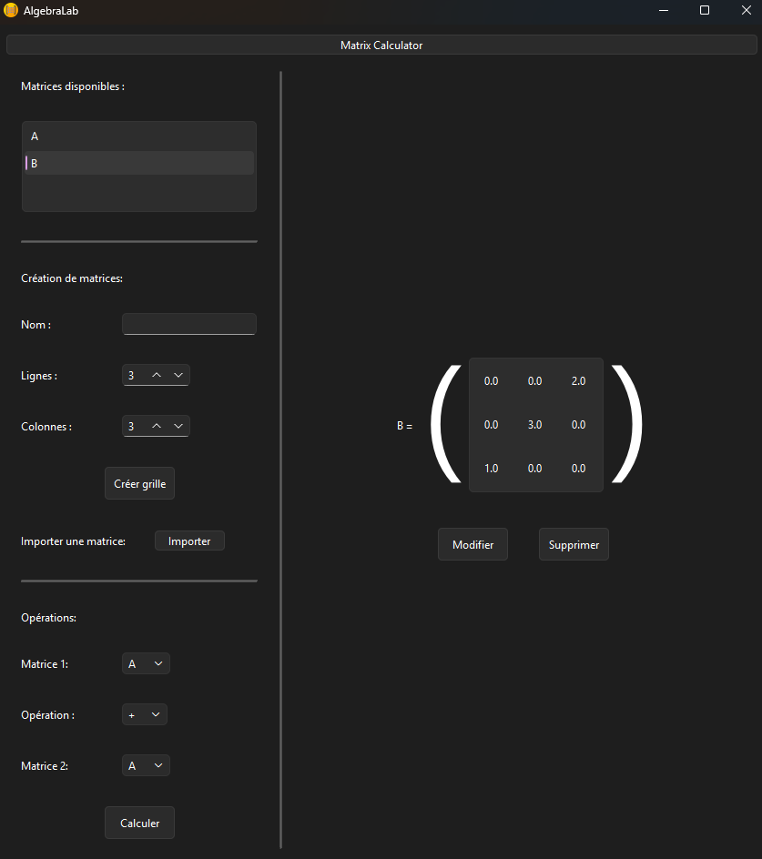

# AlgebraLab

AlgebraLab est une application de bureau développée en Python pour manipuler des matrices à travers une interface graphique.

L’objectif principal de ce projet est de proposer une interface claire et accessible permettant de créer, visualiser et gérer des matrices sans avoir à utiliser directement le terminal.

## Aperçu

L’application permet d’enregistrer des matrices dans une base de données locale, puis de les retrouver et de les manipuler depuis l’interface graphique.

Le projet met principalement l’accent sur :

- la conception d’une interface graphique ;
- l’organisation des différentes fenêtres de l’application ;
- la gestion des interactions avec l’utilisateur ;
- la séparation entre l’interface, la logique métier et l’accès aux données.

## Fonctionnalités

AlgebraLab permet actuellement de :

- créer une matrice depuis l’interface ;
- importer une matrice depuis un fichier ;
- enregistrer des matrices dans une base de données SQLite ;
- afficher les matrices enregistrées ;
- modifier une matrice ;
- supprimer une matrice ;
- additionner deux matrices ;
- multiplier deux matrices.

## Screenshots



## Technologies utilisées

- Python
- PyQt
- PySide6
- SQLite
- NumPy
- PyInstaller

## Structure du projet

```text
AlgebraLab/
├── assets/
├── data/
├── src/algebralab/
├── tests/
├── AlgebraLab.spec
├── README.md
└── requirements.txt
```

- `gui/` contient les fenêtres et les composants de l’interface graphique.
- `manager/` assure la communication entre l’interface et la logique de l’application.
- `algebra/` implémentation des opérations sur les matrices.
- `database/` contient les fonctions d’accès à la base de données SQLite.
- `config.py` centralise les chemins vers les ressources de l’application.
- `assets/` contient les ressources graphiques, notamment l’icône.
- `data/` contient la base de données locale.

## Download

La dernière version exécutable pour Windows est disponible sur la page
[Releases](../../releases/latest).

Windows SmartScreen peut afficher un avertissement car le fichier exécutable n'est pas signé numériquement. 
Sélectionnez **Plus d'informations**, puis **Exécuter quand même**.

## Installation

### 1. Cloner le dépôt

```bash
git clone https://github.com/EddyBernard-Fr/AlgebraLab.git
cd AlgebraLab
```

### 2. Créer un environnement virtuel

Sous Windows :

```powershell
python -m venv .venv
.\.venv\Scripts\Activate.ps1
```

Sous Linux ou macOS :

```bash
python -m venv .venv
source .venv/bin/activate
```

### 3. Installer les dépendances

```bash
python -m pip install -r requirements.txt
```

## Lancement depuis le code source

Depuis la racine du projet, sous PowerShell :

```powershell
$env:PYTHONPATH="src"
python -m algebralab.main
```

Sous Linux ou macOS :

```bash
PYTHONPATH=src python -m algebralab.main
```

## Création de l’exécutable Windows

PyInstaller permet de générer une version exécutable de l’application.

Installez PyInstaller si nécessaire :

```bash
python -m pip install pyinstaller
```

Puis lancez la construction depuis la racine du projet :

```bash
pyinstaller --clean AlgebraLab.spec
```

L’exécutable est ensuite disponible dans :

```text
dist/AlgebraLab.exe
```

Les dossiers `build/` et `dist/` sont générés automatiquement et ne sont pas suivis par Git.

## Base de données

Les matrices sont enregistrées localement dans une base de données SQLite.

Aucun serveur de base de données externe n’est nécessaire pour utiliser l’application.

Lors de l'exécution du fichier exécutable du package, AlgebraLab stocke les données utilisateur dans : %LOCALAPPDATA%\AlgebraLab

Lorsqu'on exécute le programme à partir du code source, la base de données de développement se trouve dans le
répertoire data du projet.

## Objectif pédagogique

AlgebraLab a principalement été réalisé pour approfondir :

- la création d’interfaces graphiques en Python ;
- la gestion d’événements et d’interactions utilisateur ;
- l’organisation d’une application en plusieurs modules ;
- l’utilisation d’une base SQLite ;
- la génération d’un exécutable avec PyInstaller.

## Améliorations possibles

Parmi les évolutions envisagées :

- ajout de nouvelles opérations matricielles ;
- amélioration de la validation des saisies ;
- ajout de tests automatisés ;
- amélioration de la gestion des erreurs ;
- automatisation de la création de l’exécutable ;
- publication de versions téléchargeables avec GitHub Releases.

## Auteur

Projet développé par Eddy Bernard.